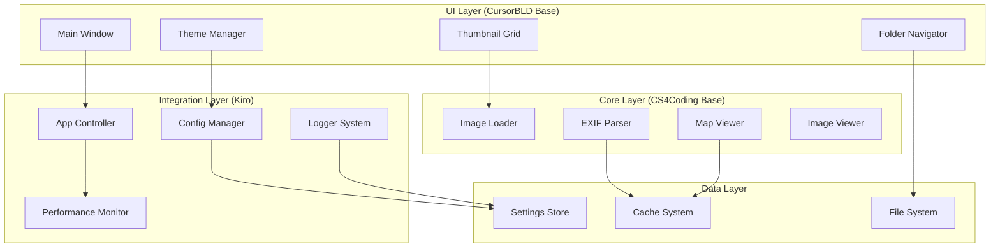

# Design Document

## Overview

PhotoGeoViewのAI統合設計は、3つのAIエージェント（GitHub Copilot、Cursor、Kiro）の開発成果を統合し、各AIの強みを活かした最適なハイブリッドアプリケーションを構築することを目的とする。この設計では、CursorBLDのUI/UX優位性、CS4Codingのコア機能安定性、そしてKiroの統合・品質管理能力を組み合わせる。

## Architecture

### High-Level Architecture



### Component Integration Strategy

#### UI Components (CursorBLD優先)
- **MainWindow**: CursorBLDのレイアウト + CS4Codingの機能統合
- **ThemeManager**: CursorBLDのQt-Theme-Manager統合システム
- **ThumbnailGrid**: CursorBLDの高速表示 + Kiroメモリ最適化
- **FolderNavigator**: CursorBLDの履歴機能 + Kiroパフォーマンス改善

#### Core Components (CS4Coding優先)
- **ImageLoader**: CS4Codingの画像処理 + Kiro例外処理強化
- **ExifParser**: CS4Codingの高精度解析 + Kiroデータ構造統一
- **MapViewer**: CS4Codingのfolium統合 + Kiroキャッシュ機能
- **ImageViewer**: CS4Codingのズーム・パン + KiroUI統合

#### Integration Components (Kiro新規)
- **AppController**: 全体制御・AI間調整
- **ConfigManager**: 統一設定管理
- **LoggerSystem**: 統合ログ・監視
- **PerformanceMonitor**: リアルタイム性能監視

## Components and Interfaces

### Core Interfaces

#### IImageProcessor
```python
from abc import ABC, abstractmethod
from typing import Optional, Dict, Any
from pathlib import Path

class IImageProcessor(ABC):
    @abstractmethod
    def load_image(self, path: Path) -> Optional[Any]:
        """画像を読み込む"""
        pass

    @abstractmethod
    def generate_thumbnail(self, image: Any, size: tuple) -> Any:
        """サムネイルを生成する"""
        pass

    @abstractmethod
    def extract_exif(self, path: Path) -> Dict[str, Any]:
        """EXIF情報を抽出する"""
        pass
```

#### IThemeManager
```python
from abc import ABC, abstractmethod
from typing import List, Dict, Any

class IThemeManager(ABC):
    @abstractmethod
    def get_available_themes(self) -> List[str]:
        """利用可能なテーマ一覧を取得"""
        pass

    @abstractmethod
    def apply_theme(self, theme_name: str) -> bool:
        """テーマを適用"""
        pass

    @abstractmethod
    def get_theme_config(self, theme_name: str) -> Dict[str, Any]:
        """テーマ設定を取得"""
        pass
```

#### IMapProvider
```python
from abc import ABC, abstractmethod
from typing import Optional, Tuple, Any

class IMapProvider(ABC):
    @abstractmethod
    def create_map(self, center: Tuple[float, float], zoom: int = 10) -> Any:
        """地図を作成"""
        pass

    @abstractmethod
    def add_marker(self, map_obj: Any, lat: float, lon: float, popup: str) -> None:
        """マーカーを追加"""
        pass

    @abstractmethod
    def render_html(self, map_obj: Any) -> str:
        """HTML形式でレンダリング"""
        pass
```

### Integration Components

#### AppController (Kiro統合制御)
```python
class AppController:
    def __init__(self):
        self.image_processor = self._create_image_processor()
        self.theme_manager = self._create_theme_manager()
        self.map_provider = self._create_map_provider()
        self.config_manager = ConfigManager()
        self.logger = LoggerSystem()
        self.performance_monitor = PerformanceMonitor()

    def _create_image_processor(self) -> IImageProcessor:
        """CS4Coding ImageLoader + Kiro最適化"""
        return IntegratedImageProcessor()

    def _create_theme_manager(self) -> IThemeManager:
        """CursorBLD ThemeManager + Kiro拡張"""
        return IntegratedThemeManager()

    def _create_map_provider(self) -> IMapProvider:
        """CS4Coding MapViewer + Kiroキャッシュ"""
        return IntegratedMapProvider()
```

## Data Models

### Core Data Models

#### ImageMetadata
```python
from dataclasses import dataclass
from typing import Optional, Dict, Any
from datetime import datetime
from pathlib import Path

@dataclass
class ImageMetadata:
    """統合画像メタデータモデル"""
    file_path: Path
    file_size: int
    created_date: datetime
    modified_date: datetime

    # EXIF情報 (CS4Coding精度)
    camera_make: Optional[str] = None
    camera_model: Optional[str] = None
    lens_model: Optional[str] = None
    focal_length: Optional[float] = None
    aperture: Optional[float] = None
    shutter_speed: Optional[str] = None
    iso: Optional[int] = None

    # GPS情報 (CS4Coding精度)
    latitude: Optional[float] = None
    longitude: Optional[float] = None
    altitude: Optional[float] = None
    gps_timestamp: Optional[datetime] = None

    # UI情報 (CursorBLD最適化)
    thumbnail_path: Optional[Path] = None
    thumbnail_size: Optional[tuple] = None
    display_name: str = ""

    # Kiro統合情報
    processing_status: str = "pending"
    cache_key: Optional[str] = None
    performance_metrics: Dict[str, Any] = None
```

#### ThemeConfiguration
``
@dataclass
class ThemeConfiguration:
    """統合テーマ設定モデル"""
    name: str
    display_name: str

    # CursorBLD テーマシステム
    qt_theme_name: str
    style_sheet: str
    color_scheme: Dict[str, str]

    # Kiro拡張機能
    accessibility_features: Dict[str, bool]
    performance_settings: Dict[str, Any]
    custom_properties: Dict[str, Any]
```

#### ApplicationState
```python
@dataclass
class ApplicationState:
    """統合アプリケーション状態モデル"""
    current_folder: Optional[Path] = None
    selected_image: Optional[Path] = None
    current_theme: str = "default"

    # CursorBLD UI状態
    thumbnail_size: int = 150
    folder_history: List[Path] = None
    ui_layout: Dict[str, Any] = None

    # CS4Coding 機能状態
    map_center: Optional[Tuple[float, float]] = None
    map_zoom: int = 10
    exif_display_mode: str = "detailed"

    # Kiro統合状態
    performance_mode: str = "balanced"
    cache_status: Dict[str, Any] = None
    ai_component_status: Dict[str, str] = None
```

## Error Handling

### Unified Error Handling Strategy

#### Error Categories
```python
from enum import Enum

class ErrorCategory(Enum):
    UI_ERROR = "ui"           # CursorBLD UI関連エラー
    CORE_ERROR = "core"       # CS4Coding機能エラー
    INTEGRATION_ERROR = "integration"  # Kiro統合エラー
    SYSTEM_ERROR = "system"   # システムレベルエラー
```

#### Error Handler
```python
class IntegratedErrorHandler:
    def __init__(self, logger: LoggerSystem):
        self.logger = logger
        self.error_strategies = {
            ErrorCategory.UI_ERROR: self._handle_ui_error,
            ErrorCategory.CORE_ERROR: self._handle_core_error,
            ErrorCategory.INTEGRATION_ERROR: self._handle_integration_error,
            ErrorCategory.SYSTEM_ERROR: self._handle_system_error
        }

    def handle_error(self, error: Exception, category: ErrorCategory, context: Dict[str, Any]):
        """統一エラーハンドリング"""
        self.logger.error(f"[{category.value}] {str(error)}", extra=context)

        strategy = self.error_strategies.get(category)
        if strategy:
            return strategy(error, context)

        return self._default_error_handling(error, context)

    def _handle_ui_error(self, error: Exception, context: Dict[str, Any]):
        """CursorBLD UI エラー処理"""
        # UI要素のリセット、ユーザー通知
        pass

    def _handle_core_error(self, error: Exception, context: Dict[str, Any]):
        """CS4Coding 機能エラー処理"""
        # 機能の代替実装、データ復旧
        pass

    def _handle_integration_error(self, error: Exception, context: Dict[str, Any]):
        """Kiro統合エラー処理"""
        # AI間調整、パフォーマンス最適化
        pass
```

## Testing Strategy

### Multi-AI Integration Testing

#### Test Categories

1. **Unit Tests**: 各AI実装の個別テスト
2. **Integration Tests**: AI間連携テスト
3. **Performance Tests**: 統合パフォーマンステスト
4. **UI Tests**: 統合UI/UXテスト
5. **Compatibility Tests**: AI互換性テスト

#### Test Framework Structure
```python
class AIIntegrationTestSuite:
    def __init__(self):
        self.cursor_tests = CursorBLDTestSuite()
        self.copilot_tests = CS4CodingTestSuite()
        self.kiro_tests = KiroIntegrationTestSuite()

    def run_integration_tests(self):
        """AI統合テストの実行"""
        results = {
            'ui_integration': self._test_ui_integration(),
            'core_integration': self._test_core_integration(),
            'performance_integration': self._test_performance_integration(),
            'compatibility': self._test_ai_compatibility()
        }
        return results

    def _test_ui_integration(self):
        """CursorBLD UI + CS4Coding機能統合テスト"""
        pass

    def _test_core_integration(self):
        """CS4Coding機能 + Kiro最適化統合テスト"""
        pass

    def _test_performance_integration(self):
        """全AI統合パフォーマンステスト"""
        pass

    def _test_ai_compatibility(self):
        """AI間互換性テスト"""
        pass
```

### Continuous Integration Pipeline

#### CI/CD Strategy
```yaml
# .github/workflows/ai-integration.yml
name: AI Integration CI/CD

on: [push, pull_request]

jobs:
  ai-integration-tests:
    runs-on: ubuntu-latest
    steps:
      - name: Checkout code
        uses: actions/checkout@v3

      - name: Setup Python
        uses: actions/setup-python@v4
        with:
          python-version: '3.11'

      - name: Install dependencies
        run: pip install -r requirements.txt

      - name: Run CursorBLD tests
        run: python -m pytest tests/cursor_tests/

      - name: Run CS4Coding tests
        run: python -m pytest tests/copilot_tests/

      - name: Run Kiro integration tests
        run: python -m pytest tests/kiro_tests/

      - name: Run AI integration tests
        run: python -m pytest tests/integration_tests/

      - name: Performance benchmarks
        run: python tests/performance_benchmarks.py

      - name: Generate integration report
        run: python tools/generate_integration_report.py
```

## Implementation Phases

### Phase 1: Foundation Setup (Kiro主導)
- 統合アーキテクチャの構築
- 共通インターフェースの定義
- 基本的な統合テスト環境の準備

### Phase 2: UI Integration (CursorBLD + Kiro)
- MainWindowの統合
- ThemeManagerの統合
- ThumbnailGridの最適化統合

### Phase 3: Core Integration (CS4Coding + Kiro)
- ImageLoaderの統合
- ExifParserの統合
- MapViewerの統合

### Phase 4: Full Integration (全AI協調)
- 全コンポーネントの統合
- パフォーマンス最適化
- 包括的テスト実行

### Phase 5: Quality Assurance (Kiro監視)
- 品質メトリクス監視
- ユーザビリティテスト
- 継続的改善システム

この設計により、各AIの強みを最大限に活かしながら、統一された高品質なPhotoGeoViewアプリケーションを構築できる。
