# Design Document

## Overview

CI/CDシミュレーションツールは、GitHubActionsのワークフローをローカル環境で再現し、コミット前にエラーを検出するためのPythonベースのツールです。既存のGitHub Actionsワークフロー（ai-integration-ci.yml、ai-integration-tests.yml）を分析し、同等のチェックをローカルで実行します。

このツールは、PhotoGeoViewプロジェクトの複雑なAI統合環境（Copilot、Cursor、Kiro）に対応し、マルチPythonバージョンテスト、Qt依存関係の処理、セキュリティスキャン、パフォーマンステストを包括的にサポートします。

## Architecture

### Core Components

```mermaid
graph TB
    A[CI Simulator CLI] --> B[Configuration Manager]
    A --> C[Check Orchestrator]

    C --> D[Code Quality Checker]
    C --> E[Test Runner]
    C --> F[Security Scanner]
    C --> G[Performance Analyzer]
    C --> H[AI Component Tester]

    D --> I[Black Formatter]
    D --> J[isort Import Sorter]
    D --> K[flake8 Style Checker]
    D --> L[mypy Type Checker]

    E --> M[Unit Test Runner]
    E --> N[Integration Test Runner]
    E --> O[AI Compatibility Tester]

    F --> P[Safety Vulnerability Scanner]
    F --> Q[Bandit Security Linter]

    G --> R[Benchmark Runner]
    G --> S[Performance Regression Detector]

    H --> T[Copilot Component Tests]
    H --> U[Cursor Component Tests]
    H --> V[Kiro Component Tests]

    B --> W[Environment Setup]
    W --> X[Python Version Manager]
    W --> Y[Qt Dependencies Manager]
    W --> Z[Virtual Display Manager]

    AA[Report Generator] --> BB[Markdown Reporter]
    AA --> CC[JSON Reporter]
    AA --> DD[History Tracker]

    C --> AA
```



### Directory Structure

```
tools/
├── ci/
│   ├── __init__.py
│   ├── simulator.py              # メインシミュレーター
│   ├── config_manager.py         # 設定管理
│   ├── check_orchestrator.py     # チェック統制
│   ├── checkers/
│   │   ├── __init__.py
│   │   ├── code_quality.py       # コード品質チェック
│   │   ├── test_runner.py        # テスト実行
│   │   ├── security_scanner.py   # セキュリティスキャン
│   │   ├── performance_analyzer.py # パフォーマンス分析
│   │   └── ai_component_tester.py # AIコンポーネントテスト
│   ├── environment/
│   │   ├── __init__.py
│   │   ├── python_manager.py     # Pythonバージョン管理
│   │   ├── qt_manager.py         # Qt依存関係管理
│   │   └── display_manager.py    # 仮想ディスプレイ管理
│   ├── reporters/
│   │   ├── __init__.py
│   │   ├── markdown_reporter.py  # Markdownレポート生成
│   │   ├── json_reporter.py      # JSONレポート生成
│   │   └── history_tracker.py    # 履歴追跡
│   └── templates/
│       ├── report_template.md    # レポートテンプレート
│       └── pre_commit_hook.sh    # pre-commitフックテンプレート

.kiro/
├── ci-history/                   # CI実行履歴
│   ├── YYYY-MM-DD_HH-MM-SS/
│   │   ├── results.json
│   │   ├── benchmark.json
│   │   └── summary.md
│   └── trends.json               # 傾向分析データ

reports/                          # 生成されるレポート
├── ci-simulation/
│   ├── latest/
│   │   ├── full_report.md
│   │   ├── results.json
│   │   └── benchmark.json
│   └── YYYY-MM-DD_HH-MM-SS/      # タイムスタンプ付きアーカイブ

logs/                            # ログファイル
├── ci-simulation.log
├── performance.log
└── security-scan.log
```

## Components and Interfaces

### 1. CI Simulator CLI (simulator.py)

メインエントリーポイントとして、コマンドライン引数を解析し、適切なチェックを実行します。

```python
class CISimulator:
    def __init__(self, config_path: Optional[str] = None):
    def run(self, checks: List[str] = None, python_versions: List[str] = None) -> SimulationResult:
    def setup_git_hook(self) -> bool:
    def cleanup(self, keep_reports: bool = True) -> None:
```

**主要機能:**
- コマンドライン引数解析
- 設定ファイル読み込み
- チェック実行の統制
- Git hookセットアップ
- 結果の統合とレポート生成

### 2. Configuration Manager (config_manager.py)

設定の読み込み、環境変数の管理、デフォルト値の提供を行います。

```python
class ConfigManager:
    def __init__(self, config_path: Optional[str] = None):
    def load_config(self) -> Dict[str, Any]:
    def get_python_versions(self) -> List[str]:
    def get_check_configuration(self, check_name: str) -> Dict[str, Any]:
    def update_gitignore(self) -> None:
```

**設定項目:**
- サポートするPythonバージョン
- 各チェックの有効/無効
- タイムアウト設定
- 出力ディレクトリ設定
- AI統合固有の設定

### 3. Check Orchestrator (check_orchestrator.py)

複数のチェックを並列実行し、依存関係を管理します。

```python
class CheckOrchestrator:
    def __init__(self, config: Dict[str, Any]):
    def execute_checks(self, checks: List[str], python_versions: List[str]) -> Dict[str, CheckResult]:
    def resolve_dependencies(self, checks: List[str]) -> List[str]:
    def run_parallel_checks(self, checks: List[CheckTask]) -> Dict[str, CheckResult]:
```

### 4. Code Quality Checker (checkers/code_quality.py)

Black、isort、flake8、mypyを使用したコード品質チェックを実行します。

```python
class CodeQualityChecker:
    def run_black(self, auto_fix: bool = False) -> CheckResult:
    def run_isort(self, auto_fix: bool = False) -> CheckResult:
    def run_flake8(self) -> CheckResult:
    def run_mypy(self) -> CheckResult:
    def run_all_quality_checks(self, auto_fix: bool = False) -> Dict[str, CheckResult]:
```

### 5. Test Runner (checkers/test_runner.py)

pytest を使用した各種テストの実行を管理します。

```python
class TestRunner:
    def __init__(self, python_version: str):
    def run_unit_tests(self) -> CheckResult:
    def run_integration_tests(self) -> CheckResult:
    def run_ai_compatibility_tests(self) -> CheckResult:
    def run_performance_tests(self) -> CheckResult:
    def run_demo_scripts(self) -> CheckResult:
```

### 6. Security Scanner (checkers/security_scanner.py)

safety と bandit を使用したセキュリティスキャンを実行します。

```python
class SecurityScanner:
    def run_safety_check(self) -> CheckResult:
    def run_bandit_scan(self) -> CheckResult:
    def run_full_security_scan(self) -> Dict[str, CheckResult]:
    def generate_security_report(self, results: Dict[str, CheckResult]) -> str:
```

### 7. Performance Analyzer (checkers/performance_analyzer.py)

ベンチマークテストの実行と回帰検出を行います。

```python
class PerformanceAnalyzer:
    def run_benchmarks(self) -> CheckResult:
    def compare_with_baseline(self, current_results: Dict) -> RegressionReport:
    def detect_performance_regression(self, threshold: float = 30.0) -> List[RegressionIssue]:
    def save_baseline(self, results: Dict) -> None:
```

### 8. AI Component Tester (checkers/ai_component_tester.py)

Copilot、Cursor、Kiroの各AIコンポーネントのテストを実行します。

```python
class AIComponentTester:
    def test_copilot_components(self) -> CheckResult:
    def test_cursor_components(self) -> CheckResult:
    def test_kiro_components(self) -> CheckResult:
    def run_ai_integration_tests(self) -> Dict[str, CheckResult]:
    def validate_ai_compatibility(self) -> CheckResult:
```

## Data Models

### CheckResult

```python
@dataclass
class CheckResult:
    name: str
    status: CheckStatus  # SUCCESS, FAILURE, WARNING, SKIPPED
    duration: float
    output: str
    errors: List[str]
    warnings: List[str]
    suggestions: List[str]
    metadata: Dict[str, Any]
```

### SimulationResult

```python
@dataclass
class SimulationResult:
    overall_status: CheckStatus
    total_duration: float
    check_results: Dict[str, CheckResult]
    python_versions_tested: List[str]
    summary: str
    report_paths: Dict[str, str]  # format -> path
```

### RegressionIssue

```python
@dataclass
class RegressionIssue:
    test_name: str
    baseline_value: float
    current_value: float
    regression_percentage: float
    severity: str  # CRITICAL, HIGH, MEDIUM, LOW
    description: str
```

## Error Handling

### エラー分類と対応

1. **環境エラー**
   - Python バージョン不足
   - Qt 依存関係不足
   - 仮想ディスプレイ設定エラー
   - **対応**: 詳細なセットアップガイドの表示、自動インストールスクリプトの提供

2. **設定エラー**
   - 不正な設定ファイル
   - 存在しないチェック名の指定
   - **対応**: デフォルト設定へのフォールバック、利用可能オプションの表示

3. **実行エラー**
   - テスト実行失敗
   - タイムアウト
   - メモリ不足
   - **対応**: 部分的な結果の保存、リトライ機能、リソース使用量の最適化

4. **レポート生成エラー**
   - ディスク容量不足
   - 権限エラー
   - **対応**: 代替出力先の使用、最小限レポートの生成

### エラー回復戦略

```python
class ErrorHandler:
    def handle_environment_error(self, error: EnvironmentError) -> RecoveryAction:
    def handle_test_failure(self, test_name: str, error: Exception) -> RecoveryAction:
    def handle_timeout(self, check_name: str) -> RecoveryAction:
    def generate_error_report(self, errors: List[Exception]) -> str:
```

## Testing Strategy

### Unit Testing

- 各チェッカークラスの個別テスト
- モックを使用した外部依存関係の分離
- エラーハンドリングのテスト
- 設定管理のテスト

### Integration Testing

- 実際のプロジェクトファイルを使用したエンドツーエンドテスト
- 複数Pythonバージョンでの動作確認
- Git hook機能のテスト
- レポート生成の検証

### Performance Testing

- 大規模プロジェクトでの実行時間測定
- メモリ使用量の監視
- 並列実行の効率性検証

### AI Integration Testing

- 各AIコンポーネントとの互換性確認
- AI固有のテストケースの実行
- 統合レポートの品質検証

## Implementation Notes

### Python Version Management

複数のPythonバージョンでのテストをサポートするため、以下のアプローチを使用：

1. **pyenv** または **conda** の検出と使用
2. **Docker** コンテナでの分離実行（オプション）
3. **仮想環境** の自動作成と管理

### Qt Dependencies Handling

GUI テストのためのQt依存関係を適切に処理：

1. **システムパッケージ** の自動検出
2. **仮想ディスプレイ** (Xvfb) の自動セットアップ
3. **環境変数** の適切な設定

### Parallel Execution

効率的な実行のための並列処理：

1. **独立したチェック** の並列実行
2. **依存関係** を考慮した実行順序
3. **リソース制限** を考慮した並列度調整

### Report Generation

包括的で読みやすいレポートの生成：

1. **Markdown形式** での詳細レポート
2. **JSON形式** での機械可読データ
3. **履歴データ** との比較分析
4. **改善提案** の自動生成
