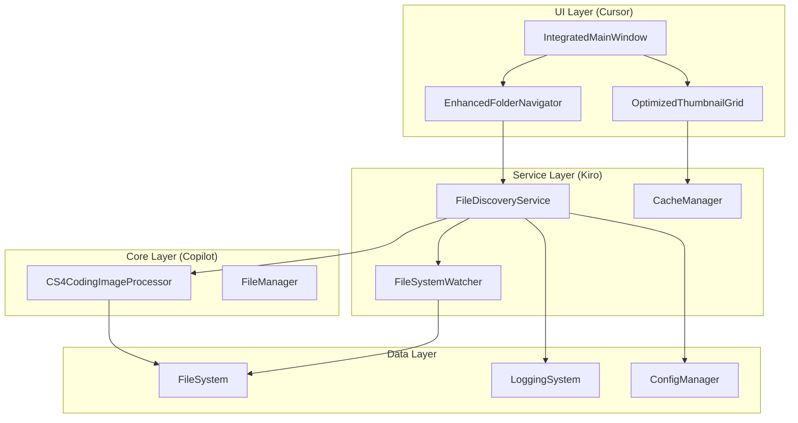
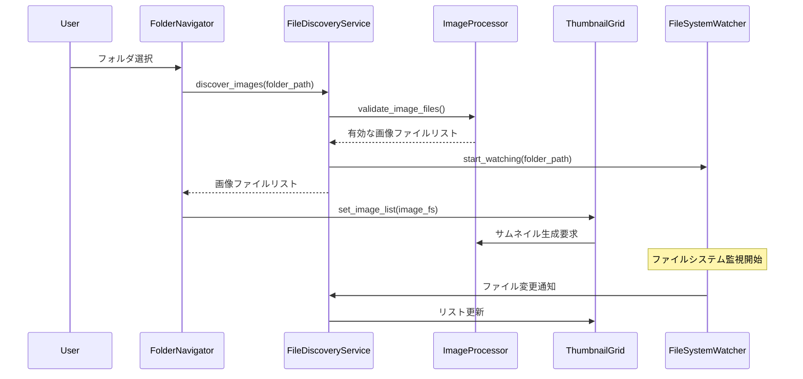

# ファイルリスト表示修正 - 設計文書

## 概要

画像があるフォルダでもファイルリストが表示されない問題を修正するため、フォルダナビゲーターとサムネイルグリッドの連携を強化し、ファイル検出機能を改善します。この設計では、既存のAI統合アーキテクチャ（Copilot、Cursor、Kiro）を活用しながら、パフォーマンスとユーザビリティを向上させます。

## アーキテクチャ

### システム構成図



### コンポーネント間の連携フロー



## コンポーネントと インターフェース

### 1. FileDiscoveryService (新規作成)

**責任**: フォルダ内の画像ファイル検出と管理

```python
class FileDiscoveryService:
    """
    画像ファイル検出サービス
    - 対応形式のファイル検出
    - ファイルバリデーション
    - パフォーマンス最適化
    """

    def discover_images(self, folder_path: Path) -> List[Path]
    def validate_image_file(self, file_path: Path) -> bool
    def get_supported_extensions(self) -> Set[str]
    def scan_folder_async(self, folder_path: Path) -> AsyncIterator[Path]
    def get_discovery_stats(self) -> Dict[str, Any]
```

**主要機能**:
- 画像形式の検出（.jpg, .jpeg, .png, .gif, .bmp, .tiff, .webp）
- ファイルバリデーション（破損ファイルの除外）
- 大量ファイル対応（段階的読み込み）
- キャッシュ機能（検出結果の保存）

### 2. EnhancedFolderNavigator (拡張)

**既存機能の拡張**:
- FileDiscoveryServiceとの連携
- エラーハンドリングの強化
- 日本語メッセージ対応

```python
# 追加メソッド
def _discover_images_in_folder(self, folder_path: Path) -> List[Path]
def _handle_discovery_error(self, error: Exception, folder_path: Path)
def _show_no_images_message(self)
def _update_file_count_display(self, count: int)
```

### 3. OptimizedThumbnailGrid (拡張)

**既存機能の拡張**:
- 動的ファイルリスト更新
- エラー状態の表示改善
- パフォーマンス監視

```python
# 追加メソッド
def update_image_list(self, image_list: List[Path])
def clear_thumbnails_safely(self)
def show_loading_state(self, message: str)
def show_error_state(self, error_message: str)
def show_empty_state(self)
```

### 4. FileSystemWatcher (新規作成)

**責任**: ファイルシステムの変更監視

```python
class FileSystemWatcher:
    """
    ファイルシステム監視サービス
    - ファイル追加/削除の検出
    - リアルタイム更新
    - リソース効率的な監視
    """

    def start_watching(self, folder_path: Path)
    def stop_watching(self)
    def add_change_listener(self, callback: Callable)
    def get_watch_status(self) -> Dict[str, Any]
```

## データモデル

### ImageFileInfo

```python
@dataclass
class ImageFileInfo:
    """画像ファイル情報"""
    file_path: Path
    file_size: int
    modified_time: datetime
    is_valid: bool
    error_message: Optional[str] = None
    discovery_time: datetime = field(default_factory=datetime.now)

    @property
    def extension(self) -> str:
        return self.file_path.suffix.lower()

    @property
    def display_name(self) -> str:
        return self.file_path.name
```

### FolderScanResult

```python
@dataclass
class FolderScanResult:
    """フォルダスキャン結果"""
    folder_path: Path
    image_files: List[ImageFileInfo]
    scan_duration: float
    total_files_scanned: int
    valid_images_found: int
    errors: List[str]
    scan_timestamp: datetime = field(default_factory=datetime.now)

    @property
    def success_rate(self) -> float:
        if self.total_files_scanned == 0:
            return 0.0
        return self.valid_images_found / self.total_files_scanned
```

## エラーハンドリング

### エラー分類と対応

```python
class FileDiscoveryError(Exception):
    """ファイル検出エラーの基底クラス"""
    pass

class FolderAccessError(FileDiscoveryError):
    """フォルダアクセスエラー"""
    pass

class FileValidationError(FileDiscoveryError):
    """ファイルバリデーションエラー"""
    pass

class PerformanceError(FileDiscoveryError):
    """パフォーマンス関連エラー"""
    pass
```

### エラーハンドリング戦略

1. **フォルダアクセスエラー**
   - 権限不足: ユーザーに権限確認を促す日本語メッセージ
   - フォルダ不存在: 「フォルダが見つかりません」メッセージ
   - ネットワークエラー: 再試行オプション提供

2. **ファイル検証エラー**
   - 破損ファイル: ログに記録、スキップして継続
   - 未対応形式: 警告ログ、対応形式リスト表示
   - 読み込みエラー: エラーサムネイル表示

3. **パフォーマンスエラー**
   - メモリ不足: キャッシュクリア、段階的読み込み
   - 処理時間超過: プログレスバー表示、キャンセル機能

## テスト戦略

### 単体テスト

```python
class TestFileDiscoveryService:
    def test_discover_images_valid_folder(self)
    def test_discover_images_empty_folder(self)
    def test_discover_images_invalid_folder(self)
    def test_validate_image_file_valid(self)
    def test_validate_image_file_invalid(self)
    def test_performance_large_folder(self)
```

### 統合テスト

```python
class TestFolderNavigatorIntegration:
    def test_folder_selection_to_thumbnail_display(self)
    def test_file_system_watcher_integration(self)
    def test_error_handling_integration(self)
    def test_performance_monitoring_integration(self)
```

### パフォーマンステスト

- **大量ファイルテスト**: 10,000個の画像ファイルでの動作確認
- **メモリ使用量テスト**: 長時間使用でのメモリリーク検証
- **応答性テスト**: UI操作の応答時間測定

## パフォーマンス最適化

### 1. 段階的読み込み (Pagination)

```python
class PaginatedFileDiscovery:
    def __init__(self, page_size: int = 100):
        self.page_size = page_size

    def get_next_batch(self) -> List[ImageFileInfo]:
        """次のバッチを取得"""
        pass

    def has_more_files(self) -> bool:
        """さらにファイルがあるかチェック"""
        pass
```

### 2. 非同期処理

```python
async def discover_images_async(self, folder_path: Path) -> AsyncIterator[ImageFileInfo]:
    """非同期でファイルを検出"""
    async for file_info in self._scan_folder_async(folder_path):
        if await self._validate_image_async(file_info.file_path):
            yield file_info
```

### 3. キャッシュ戦略

- **ファイル情報キャッシュ**: ファイルのmtime基準でキャッシュ
- **バリデーション結果キャッシュ**: ファイルサイズ+mtime基準
- **LRUキャッシュ**: 最近使用されたフォルダ情報を優先保持

### 4. メモリ管理

```python
class MemoryAwareFileDiscovery:
    def __init__(self, max_memory_mb: int = 256):
        self.max_memory_mb = max_memory_mb
        self.memory_monitor = MemoryMonitor()

    def check_memory_usage(self):
        """メモリ使用量をチェックし、必要に応じてキャッシュクリア"""
        if self.memory_monitor.get_usage_mb() > self.max_memory_mb:
            self.clear_cache()
```

## 日本語対応とアクセシビリティ

### メッセージ定義

```python
MESSAGES = {
    "folder_scanning": "フォルダをスキャン中...",
    "no_images_found": "このフォルダには画像ファイルが見つかりませんでした",
    "images_found": "{count}個の画像ファイルが見つかりました",
    "scan_error": "フォルダのスキャン中にエラーが発生しました: {error}",
    "permission_error": "フォルダへのアクセス権限がありません",
    "folder_not_found": "指定されたフォルダが見つかりません",
    "loading_thumbnails": "サムネイルを読み込み中... ({current}/{total})",
    "scan_complete": "スキャン完了: {duration:.1f}秒",
    "memory_warning": "メモリ使用量が多くなっています。キャッシュをクリアしますか？"
}
```

### アクセシビリティ機能

1. **スクリーンリーダー対応**
   - ファイル数の音声読み上げ
   - 進行状況の通知
   - エラー状態の明確な説明

2. **キーボードナビゲーション**
   - フォルダ選択のショートカット
   - サムネイル間の移動
   - 更新機能のキーボードアクセス

3. **高コントラストモード**
   - エラー状態の視覚的強調
   - 読み込み状態の明確な表示
   - 選択状態のハイライト

## セキュリティ考慮事項

### ファイルアクセス制御

```python
class SecureFileAccess:
    def __init__(self):
        self.allowed_extensions = {'.jpg', '.jpeg', '.png', '.gif', '.bmp', '.tiff', '.webp'}
        self.max_file_size = 100 * 1024 * 1024  # 100MB

    def is_safe_file(self, file_path: Path) -> bool:
        """ファイルが安全かチェック"""
        # 拡張子チェック
        if file_path.suffix.lower() not in self.allowed_extensions:
            return False

        # ファイルサイズチェック
        if file_path.stat().st_size > self.max_file_size:
            return False

        # パストラバーサル攻撃防止
        try:
            file_path.resolve().relative_to(Path.cwd())
        except ValueError:
            return False

        return True
```

### ログセキュリティ

- 個人情報を含むパス情報のマスキング
- エラーログの適切なレベル設定
- 機密情報の漏洩防止

## 監視とログ

### パフォーマンス監視

```python
class FileDiscoveryMetrics:
    def __init__(self):
        self.scan_times: List[float] = []
        self.file_counts: List[int] = []
        self.error_counts: Dict[str, int] = defaultdict(int)

    def record_scan(self, duration: float, file_count: int):
        """スキャン結果を記録"""
        self.scan_times.append(duration)
        self.file_counts.append(file_count)

    def get_performance_summary(self) -> Dict[str, Any]:
        """パフォーマンス要約を取得"""
        return {
            "avg_scan_time": statistics.mean(self.scan_times),
            "avg_file_count": statistics.mean(self.file_counts),
            "total_errors": sum(self.error_counts.values()),
            "error_breakdown": dict(self.error_counts)
        }
```

### ログ出力例

```python
# 正常ケース
logger.info("フォルダスキャン開始: %s", folder_path)
logger.info("画像ファイル検出完了: %d個のファイルを%.2f秒で処理", file_count, duration)

# エラーケース
logger.error("フォルダアクセスエラー: %s - %s", folder_path, error_message)
logger.warning("パフォーマンス警告: スキャン時間が閾値を超過 (%.2f秒)", duration)

# デバッグ情報
logger.debug("ファイルバリデーション: %s - %s", file_path, "有効" if is_valid else "無効")
```

## 実装優先度

### Phase 1: 基本機能 (高優先度)
1. FileDiscoveryService の基本実装
2. フォルダナビゲーターとの連携
3. 基本的なエラーハンドリング
4. 日本語メッセージ対応

### Phase 2: パフォーマンス最適化 (中優先度)
1. 非同期処理の実装
2. キャッシュ機能の追加
3. 段階的読み込み
4. メモリ管理

### Phase 3: 高度な機能 (低優先度)
1. ファイルシステム監視
2. 詳細なパフォーマンス監視
3. アクセシビリティ機能の拡張
4. セキュリティ機能の強化

この設計により、要件定義で定義されたすべての機能要件を満たしながら、既存のAI統合アーキテクチャとの整合性を保ち、パフォーマンスとユーザビリティを向上させることができます。
