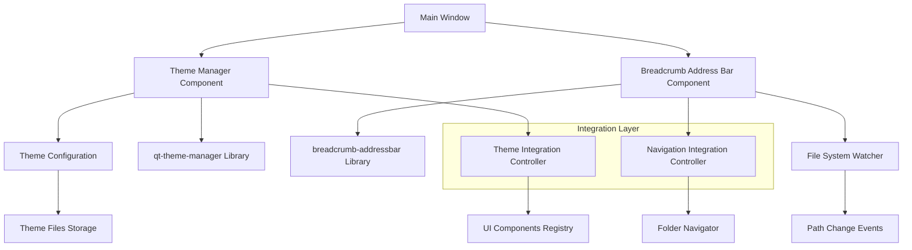

# Design Document

## Overview

This design implements a Qt theme management system and breadcrumb address bar for PhotoGeoView using the existing `qt-theme-manager` and `breadcrumb-addressbar` libraries. The implementation will integrate these libraries into the current PySide6-based architecture while maintaining compatibility with the AI integration guidelines and existing project structure.

## Architecture

### High-Level Architecture



### Component Integration

The design leverages the existing project structure:
- `src/ui/` - UI components including theme manager and breadcrumb bar
- `src/integration/` - Integratiollers for theme and navigation
- `src/core/` - Core business logic and file system operations
- `config/themes/` - Theme configuration and custom theme storage

## Components and Interfaces

### 1. Theme Manager Component

**Location:** `src/ui/theme_manager.py`

```python
class ThemeManagerWidget:
    """
    Wrapper around qt-theme-manager library providing PhotoGeoView-specific functionality
    """

    def __init__(self, config_manager: ConfigManager, logger_system: LoggerSystem):
        self.theme_manager = QtThemeManager()  # from qt-theme-manager
        self.config_manager = config_manager
        self.logger = logger_system.get_logger(__name__)

    def initialize_themes(self) -> None:
        """Load available themes and set current theme"""

    def apply_theme(self, theme_name: str) -> bool:
        """Apply theme to all registered components"""

    def register_component(self, component: QWidget) -> None:
        """Register UI component for theme updates"""

    def get_available_themes(self) -> List[ThemeInfo]:
        """Get list of available themes with metadata"""

    def import_theme(self, theme_path: Path) -> bool:
        """Import custom theme file"""

    def export_theme(self, theme_name: str, export_path: Path) -> bool:
        """Export theme to file"""
```

### 2. Breadcrumb Address Bar Component

**Location:** `src/ui/breadcrumb_bar.py`

```python
class BreadcrumbAddressBar:
    """
    Wrapper around breadcrumb-addressbar library with PhotoGeoView integration
    """

    def __init__(self, file_system_watcher: FileSystemWatcher, logger_system: LoggerSystem):
        self.breadcrumb_widget = BreadcrumbWidget()  # from breadcrumb-addressbar
        self.file_watcher = file_system_watcher
        self.logger = logger_system.get_logger(__name__)

    def set_current_path(self, path: Path) -> None:
        """Update breadcrumb display with new path"""

    def on_breadcrumb_clicked(self, path: Path) -> None:
        """Handle breadcrumb segment click navigation"""

    def handle_path_change(self, old_path: Path, new_path: Path) -> None:
        """Handle file system path changes"""

    def setup_keyboard_shortcuts(self) -> None:
        """Configure keyboard navigation shortcuts"""
```

### 3. Integration Controllers

**Theme Integration Controller** (`src/integration/theme_controller.py`):
- Manages theme application across all UI components
- Handles theme persistence and configuration
- Provides theme change notifications

**Navigation Integration Controller** (`src/integration/navigation_controller.py`):
- Coordinates breadcrumb navigation with folder navigator
- Manages path synchronization between components
- Handles file system watcher integration

## Data Models

### Theme Configuration Model

```python
@dataclass
class ThemeConfiguration:
    """Theme configuration data model"""
    name: str
    display_name: str
    description: str
    author: str
    version: str
    colors: Dict[str, str]
    fonts: Dict[str, FontConfig]
    styles: Dict[str, str]
    is_custom: bool = False
    file_path: Optional[Path] = None

@dataclass
class FontConfig:
    """Font configuration for themes"""
    family: str
    size: int
    weight: str = "normal"
    style: str = "normal"
```

### Navigation State Model

```python
@dataclass
class NavigationState:
    """Current navigation state for breadcrumb bar"""
    current_path: Path
    breadcrumb_segments: List[BreadcrumbSegment]
    is_network_path: bool
    is_accessible: bool

@dataclass
class BreadcrumbSegment:
    """Individual breadcrumb segment data"""
    name: str
    path: Path
    is_clickable: bool
    icon: Optional[str] = None
```

## Error Handling

### Theme System Error Handling

1. **Theme Loading Errors**:
   - Invalid theme files → Fallback to default theme + user notification
   - Missing theme dependencies → Graceful degradation with warnings
   - Corrupted theme configuration → Reset to default with backup creation

2. **Theme Application Errors**:
   - Component registration failures → Log error, continue with other components
   - Style application failures → Revert to previous working theme
   - Resource loading errors → Use fallback resources

### Breadcrumb Navigation Error Handling

1. **Path Access Errors**:
   - Inaccessible directories → Display error state in breadcrumb
   - Network drive disconnection → Show offline indicator
   - Permission denied → Navigate to accessible parent directory

2. **File System Watcher Errors**:
   - Watcher initialization failure → Disable automatic updates, log warning
   - Path monitoring errors → Fallback to manual refresh
   - Event processing errors → Queue events for retry

## Testing Strategy

### Unit Tests

1. **Theme Manager Tests**:
   - Theme loading and validation
   - Theme application to mock components
   - Custom theme import/export functionality
   - Error handling for invalid themes

2. **Breadcrumb Bar Tests**:
   - Path display and formatting
   - Click navigation functionality
   - Keyboard shortcut handling
   - Path truncation logic

### Integration Tests

1. **Theme Integration Tests**:
   - Theme changes across multiple UI components
   - Theme persistence across application restarts
   - Integration with existing configuration system

2. **Navigation Integration Tests**:
   - Breadcrumb synchronization with folder navigator
   - File system watcher integration
   - Cross-component navigation consistency

### Performance Tests

1. **Theme Switching Performance**:
   - Theme application time measurement
   - Memory usage during theme changes
   - UI responsiveness during theme transitions

2. **Breadcrumb Rendering Performance**:
   - Path update rendering time
   - Long path handling performance
   - Memory usage for path history

## Implementation Considerations

### Library Integration Strategy

1. **qt-theme-manager Integration**:
   - Wrap library functionality in PhotoGeoView-specific classes
   - Extend theme format to support custom PhotoGeoView components
   - Implement theme validation for PhotoGeoView requirements

2. **breadcrumb-addressbar Integration**:
   - Customize breadcrumb styling to match PhotoGeoView themes
   - Extend functionality for PhotoGeoView-specific navigation needs
   - Integrate with existing file system monitoring

### Compatibility Requirements

1. **PySide6 Compatibility**:
   - Ensure both libraries work correctly with PySide6
   - Handle any Qt version-specific differences
   - Test cross-platform compatibility (Windows, macOS, Linux)

2. **Existing Architecture Integration**:
   - Maintain compatibility with current ConfigManager
   - Integrate with existing LoggerSystem
   - Preserve current StateManager functionality

### Performance Optimization

1. **Theme System Optimization**:
   - Lazy loading of theme resources
   - Caching of compiled stylesheets
   - Efficient component registration system

2. **Breadcrumb Optimization**:
   - Efficient path segment rendering
   - Smart truncation algorithms
   - Minimal DOM updates for path changes

### Accessibility Considerations

1. **Theme Accessibility**:
   - High contrast theme support
   - Font size scaling support
   - Color blind friendly theme options

2. **Breadcrumb Accessibility**:
   - Keyboard navigation support
   - Screen reader compatibility
   - Focus management for breadcrumb segments
