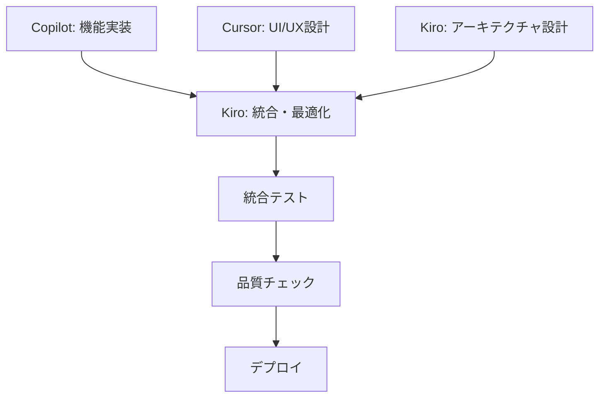

# PhotoGeoView AI統合開発戦略ドキュメント

## 概要

このドキュメントは、複数のAIコーディングエージェント環境で開発された PhotoGeoView プロジェクトの統合戦略をまとめたものです。GitHub Copilot版 (`CS4Coding` ブランチ)、Cursor版 (`CursorBLD` ブランチ)、そしてKiro版の開発成果を統合し、各AIエージェントの強みを活かした最適なハイブリッド構成を目指します。

## 🤖 AIエージェント別開発特性

### GitHub Copilot
- **強み**: コード補完精度、既存パターンの活用
- **特徴**: 段階的な機能実装、安定したコード品質

### Cursor
- **強み**: UI/UX設計、リアルタイム編集支援
- **特徴**: 直感的なインターフェース設計、テーマシステム

### Kiro
- **強み**: プロジェクト全体の構造理解、統合的な問題解決
- **特徴**: アーキテクチャ設計、複数ファイル間の整合性確保

---

## 🧩 パネル別評価・統合戦略

| パネル | 採用元 | 理由 | Kiro統合支援 |
|--------|--------|------|-------------|
| メインウィンドウのツールバー | 🎯 Cursor版 | テーマ切替UIが直感的で操作性が高い | アーキテクチャ統合、設定管理統一 |
| ファイル選択機能 | 🎯 Cursor版 | フォルダ選択・履歴機能が使いやすい | パフォーマンス最適化、エラーハンドリング強化 |
| サムネイル機能 | 🎯 Cursor版 | Qtネイティブで高速表示、サイズ変更も柔軟 | メモリ管理最適化、非同期処理改善 |
| EXIF表示部 | ✅ Copilot版 | GPS抽出・カメラ情報の表示が正確で詳細 | データ構造統一、例外処理強化 |
| プレビュー部 | ✅ Copilot版 | PaintEventによるズーム・パンが滑らか | UI/UX統合、レスポンシブ対応 |
| MAP部 | ✅ Copilot版 | folium連携が安定、マーカー表示も正確 | 地図API統合、キャッシュ機能追加 |

---

## 🛠 AI統合開発方針

### UIベース：Cursor版
- `main_window.py` のUIレイアウトとツールバーをベースに採用
- `theme_manager.py` のUI連携を維持
- **Kiro統合**: UI/UXの一貫性確保、アクセシビリティ対応

### 機能ベース：Copilot版
- `modules/image_loader.py`：画像形式判定と読み込み処理
- `modules/map_viewer.py`：EXIFからの地図表示とマーカー処理
- `modules/exif_parser.py`：GPS抽出と例外処理の完成度が高い
- **Kiro統合**: モジュール間の依存関係整理、エラーハンドリング統一

### アーキテクチャ統合：Kiro主導
- プロジェクト全体の構造設計と最適化
- 設定管理システムの統一
- テスト戦略とCI/CD統合
- ドキュメント体系の整備

---

## 📁 AI統合ブランチ構成案

```
PhotoGeoView/
├── src/
│   ├── ui/
│   │   └── main_window.py      ← Cursor版ベース + Kiro統合最適化
│   ├── modules/
│   │   ├── image_loader.py     ← Copilot版 + Kiro性能改善
│   │   ├── map_viewer.py       ← Copilot版 + Kiro統合機能
│   │   └── exif_parser.py      ← Copilot版 + Kiro例外処理強化
│   ├── core/
│   │   ├── config_manager.py   ← 全版統合 + Kiro設計
│   │   └── app_controller.py   ← Kiro新規：アプリケーション制御
│   └── utils/
│       ├── theme_manager.py    ← Cursor版 + Kiro拡張
│       └── logger.py           ← Kiro新規：統合ログシステム
├── config/
│   ├── app_config.json         ← AI統合設定ファイル
│   ├── theme_styles.json       ← テーマ設定
│   └── ai_preferences.json     ← AI別開発設定（開発用）
├── docs/
│   ├── integration_plan.md     ← このドキュメント
│   ├── ai_development_guide.md ← Kiro新規：AI開発ガイド
│   └── api_documentation.md    ← Kiro新規：API仕様書
├── tests/
│   ├── integration_tests/      ← 統合テスト
│   ├── ai_compatibility/       ← Kiro新規：AI互換性テスト
│   └── performance_tests/      ← Kiro新規：パフォーマンステスト
└── .kiro/
    ├── steering/               ← Kiro設定：開発ガイドライン
    └── settings/               ← Kiro設定：プロジェクト設定
```

---

## 🔄 AI統合開発手順

### Phase 1: 基盤準備（Kiro主導）
1. **統合ブランチ作成**: `ai-integration-main` ブランチを作成
2. **アーキテクチャ設計**: プロジェクト構造の統一設計
3. **設定システム統合**: 全AI版の設定管理を統一
4. **開発環境整備**: Kiro設定（.kiro/）の構築

### Phase 2: コア機能統合（Copilot + Kiro）
1. **画像処理**: Copilot版の `image_loader.py` + Kiro最適化
2. **EXIF処理**: Copilot版の `exif_parser.py` + Kiro例外処理強化
3. **マップ機能**: Copilot版の `map_viewer.py` + Kiro統合機能
4. **データ管理**: Kiro新規の統合データ管理システム

### Phase 3: UI/UX統合（Cursor + Kiro）
1. **メインUI**: Cursor版ベース + Kiro一貫性確保
2. **テーマシステム**: Cursor版 + Kiro拡張機能
3. **サムネイル**: Cursor版高速表示 + Kiro メモリ最適化
4. **プレビュー**: Copilot版機能 + Kiro UI統合

### Phase 4: 統合最適化（全AI協調）
1. **パフォーマンステスト**: Kiro主導の総合性能評価
2. **AI互換性テスト**: 各AI環境での動作確認
3. **ユーザビリティテスト**: 統合UI/UXの最終調整
4. **ドキュメント整備**: 開発ガイドとAPI仕様の完成

### Phase 5: 継続的統合（Kiro監視）
1. **CI/CD構築**: 自動テスト・デプロイパイプライン
2. **品質監視**: コード品質とパフォーマンス監視
3. **AI開発支援**: 各AIエージェントの開発効率向上
4. **フィードバック統合**: ユーザーフィードバックの統合管理

---

## ⚙️ AI統合技術仕様

### 依存関係の統合管理
```python
# AI統合後の主要依存関係
PyQt6>=6.5.0           # UI基盤（Cursor版ベース）
PyQt6-WebEngine>=6.4.0 # Web表示エンジン（地図表示用）
Pillow>=10.0.0          # 画像処理（Copilot版最適化）
piexif>=1.1.3           # EXIF読み書き統合（Copilot版 + Kiro強化）
folium>=0.14.0          # 地図表示（Copilot版 + Kiro拡張）
qt-theme-manager>=0.1.0 # テーマ管理（Cursor版UI統合）
pytest>=7.0.0          # テストフレームワーク（Kiro統合）
black>=23.0.0           # コードフォーマット（Kiro標準）
mypy>=1.0.0             # 型チェック（Kiro品質管理）
```

### AI統合設定ファイル戦略
- **app_config.json**: アプリケーション全体設定
- **theme_styles.json**: テーマ・UI設定（Cursor版ベース）
- **ai_preferences.json**: AI別開発設定（開発環境用）
- **user_preferences.json**: ユーザー個人設定（.gitignore対象）
- **.kiro/steering/**: Kiro開発ガイドライン
- **.kiro/settings/**: Kiroプロジェクト設定

### AI協調パフォーマンス最適化
- **サムネイル生成**: Qt6ネイティブ（Cursor） + 非同期処理（Kiro）
- **メモリ管理**: 大量画像対応（Copilot） + リーク防止（Kiro）
- **非同期処理**: EXIF/マップ並列化（Copilot） + スレッド管理（Kiro）
- **キャッシュシステム**: 統合キャッシュ戦略（Kiro設計）

### AI開発環境統合
```json
// .kiro/settings/ai_development.json
{
  "copilot": {
    "focus": "core_functionality",
    "strengths": ["code_completion", "pattern_recognition"]
  },
  "cursor": {
    "focus": "ui_ux_design",
    "strengths": ["interface_design", "theme_system"]
  },
  "kiro": {
    "focus": "architecture_integration",
    "strengths": ["project_structure", "quality_assurance"]
  }
}
```

---

## 🎯 AI統合による期待成果

### 機能面の統合効果
- ✅ **高速なサムネイル表示** (Cursor版) + **メモリ最適化** (Kiro)
- ✅ **正確なGPS情報抽出** (Copilot版) + **エラーハンドリング強化** (Kiro)
- ✅ **直感的なテーマ切替** (Cursor版) + **アクセシビリティ対応** (Kiro)
- ✅ **滑らかなプレビュー操作** (Copilot版) + **UI統合最適化** (Kiro)
- 🆕 **統合キャッシュシステム** (Kiro新規)
- 🆕 **リアルタイム性能監視** (Kiro新規)

### AI協調開発による保守性向上
- 🔧 **統一されたコード構造** (Kiro設計)
- 🔧 **明確な責任分担** (AI役割分担)
- 🔧 **テストカバレッジ向上** (全AI協調)
- 🔧 **継続的品質管理** (Kiro監視)
- 🔧 **自動化されたCI/CD** (Kiro構築)

### 統合ユーザー体験
- 🎨 **一貫したUI/UX** (Cursor + Kiro)
- ⚡ **レスポンシブな操作感** (全AI最適化)
- 🔍 **正確な地図表示** (Copilot + Kiro)
- 🌐 **多言語対応** (Kiro国際化)
- 📱 **クロスプラットフォーム対応** (Kiro統合)

### AI開発効率の向上
- 🤖 **各AIの強み活用** (専門分野集中)
- 🔄 **継続的統合** (Kiro監視・調整)
- 📊 **開発メトリクス可視化** (Kiro分析)
- 🎓 **AI学習効果の蓄積** (経験値共有)

---

## 📝 AI統合実装ノート

### 重要なファイル統合戦略
1. **main_window.py**: Cursor版ベース + Copilot機能 + Kiro統合最適化
2. **image_loader.py**: Copilot版ベース + Kiro性能改善・例外処理強化
3. **theme_manager.py**: Cursor版UI連携 + Kiro拡張機能・アクセシビリティ
4. **app_controller.py**: Kiro新規設計による統合制御システム
5. **logger.py**: Kiro新規による統合ログ・監視システム

### AI統合設定ファイル除外
```gitignore
# 個人設定（AI統合後に追加）
config/user_preferences.json
config/ai_preferences.json
cache/user_thumbnails/
cache/ai_cache/
logs/user_activity.log
logs/ai_development.log
.kiro/local_settings/

# AI開発環境固有
.copilot/
.cursor/
.kiro/temp/
```

### AI統合ブランチ戦略
- `main`: 安定版（AI統合完成版）
- `ai-integration-main`: AI統合作業ブランチ
- `CS4Coding`: Copilot版（参考・機能抽出用）
- `CursorBLD`: Cursor版（参考・UI抽出用）
- `kiro-architecture`: Kiro設計ブランチ（統合設計用）
- `ai-compatibility`: AI互換性テストブランチ

### AI協調開発ワークフロー


---

## 🚀 AI統合 Next Steps

### 即座に実行すべきアクション
1. **AI統合ブランチ作成**: `git checkout -b ai-integration-main`
2. **Kiro環境構築**: `.kiro/` ディレクトリとsteering設定の作成
3. **AI開発ガイド作成**: 各AIの役割分担と協調ルールの文書化
4. **統合テスト環境準備**: AI互換性テストの基盤構築

### 短期目標（1-2週間）
- Phase 1完了: 基盤準備とアーキテクチャ統合
- AI別開発環境の標準化
- 統合設定システムの構築
- 基本的な統合テストの実装

### 中期目標（1ヶ月）
- Phase 2-3完了: コア機能とUI/UXの統合
- パフォーマンス最適化の実装
- 包括的なテストスイートの完成
- ドキュメント体系の整備

### 長期目標（2-3ヶ月）
- Phase 4-5完了: 統合最適化と継続的統合
- CI/CDパイプラインの完全自動化
- AI協調開発ワークフローの確立
- ユーザーフィードバック統合システムの構築

## 🤝 AI協調開発体制

### 役割分担
- **GitHub Copilot**: コア機能実装・コード品質
- **Cursor**: UI/UX設計・ユーザー体験
- **Kiro**: 統合設計・品質管理・プロジェクト監視

### 協調ルール
1. 各AIは専門分野に集中し、他分野はKiroが統合調整
2. 重要な設計変更はKiroが全体影響を評価
3. 定期的な統合テストでAI間の互換性を確認
4. ドキュメントはKiroが一元管理・更新

---

*このドキュメントはAI統合開発の進行に合わせて継続的に更新されます。各AIエージェントの貢献と学習効果を記録し、より効率的な協調開発体制の構築を目指します。*
