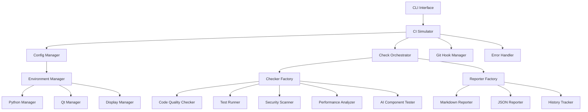

# CI Simulation Tool - Developer Guide

## Overview

This guide provides comprehensive technical documentation for developers who want to understand, extend, or contribute to the CI Simulation Tool. It covers the architecture, design patterns, extension points, and development practices.

## Table of Contents

1. [Architecture Overview](#architecture-overview)
2. [Core Components](#core-components)
3. [Design Patterns](#design-patterns)
4. [Extension Points](#extension-points)
5. [Development Setup](#development-setup)
6. [Creating Custom Checkers](#creating-custom-checkers)
7. [Testing Framework](#testing-framework)
8. [Contribution Guidelines](#contribution-guidelines)
9. [Release Process](#release-process)

## Architecture Overview

### High-Level Architecture

The CI Simulation Tool follows a modular, plugin-based architecture that promotes extensibility and maintainability.



### Directory Structure

```
tools/ci/
├── __init__.py                    # Package initialization
├── simulator.py                   # Main CLI interface
├── models.py                      # Core data models
├── interfaces.py                  # Abstract base classes
├── utils.py                       # Utility functions
├── config_manager.py              # Configuration management
├── check_orchestrator.py          # Check execution coordination
├── cli_parser.py                  # Command-line argument parsing
├── git_hook_manager.py            # Git hooks integration
├── error_handler.py               # Error handling and recovery
├── resource_manager.py            # System resource management
├── checkers/                      # Check implementations
│   ├── __init__.py
│   ├── code_quality.py           # Code quality checks
│   ├── test_runner.py            # Test execution
│   ├── security_scanner.py       # Security scanning
│   ├── performance_analyzer.py   # Performance analysis
│   └── ai_component_tester.py    # AI integration testing
├── environment/                   # Environment management
│   ├── __init__.py
│   ├── python_manager.py         # Python version management
│   ├── qt_manager.py             # Qt dependencies
│   └── display_manager.py        # Virtual display setup
├── reporters/                     # Report generation
│   ├── __init__.py
│   ├── markdown_reporter.py      # Markdown reports
│   ├── json_reporter.py          # JSON reports
│   └── history_tracker.py        # Historical analysis
├── templates/                     # Configuration templates
│   ├── __init__.py
│   ├── ci_config_template.yaml   # Configuration template
│   ├── report_template.md        # Report template
│   └── pre_commit_hook.sh        # Git hook template
└── docs/                         # Documentation
    ├── README.md                 # Documentation index
    ├── USER_GUIDE.md            # User documentation
    ├── DEVELOPER_GUIDE.md       # This file
    ├── API_REFERENCE.md         # API documentation
    └── ...
```

### Key Design Principles

1. **Modularity**: Each component has a single responsibility
2. **Extensibility**: New checkers and reporters can be easily added
3. **Configuration-Driven**: Behavior is controlled through configuration
4. **Error Resilience**: Graceful handling of failures and partial results
5. **Performance**: Parallel execution and resource optimization
6. **Testability**: Comprehensive test coverage with mocking support

## Core Components

### 1. CI Simulator (`simulator.py`)

The main orchestrator that coordinates all components.

**Key Responsibilities:**
- CLI argument parsing and validation
- Component initialization and coordination
- Execution flow control
- Result aggregation and reporting
- Error handling and cleanup

**Key Methods:**
```python
class CISimulator:
    def __init__(self, config_path: Optional[str] = None)
    def run(self, args: Optional[List[str]] = None) -> int
    def setup_git_hook(self, hook_type: str, checks: List[str]) -> bool
    def cleanup(self, keep_reports: bool = True) -> None
```

### 2. Configuration Manager (`config_manager.py`)

Handles configuration loading, validation, and environment variable integration.

**Key Features:**
- YAML/JSON configuration support
- Environment variable overrides
- Configuration validation
- Default value management
- .gitignore management

**Key Methods:**
```python
class ConfigManr:
    def __init__(self, config_path: Optional[str] = None)
    def get_config(self) -> Dict[str, Any]
    def validate_config(self, config: Dict[str, Any]) -> List[str]
    def update_gitignore(self) -> None
```

### 3. Check Orchestrator (`check_orchestrator.py`)

Manages check execution, dependency resolution, and parallel processing.

**Key Features:**
- Dependency resolution using topological sorting
- Parallel execution with resource management
- Task filtering and selection
- Progress monitoring and reporting

**Key Methods:**
```python
class CheckOrchestrator:
    def __init__(self, config: Dict[str, Any])
    def execute_checks(self, tasks: List[CheckTask]) -> Dict[str, CheckResult]
    def filter_tasks_by_selection(self, tasks: List[CheckTask], selected: List[str]) -> List[CheckTask]
    def get_available_checks(self) -> List[str]
```

### 4. Checker Factory (`interfaces.py`)

Factory pattern implementation for creating and managing checker instances.

**Key Features:**
- Dynamic checker registration
- Lazy loading of checker implementations
- Availability checking
- Configuration injection

**Key Methods:**
```python
class CheckerFactory:
    @classmethod
    def register_checker(cls, name: str, checker_class: Type[CheckerInterface])
    @classmethod
    def create_checker(cls, name: str, config: Dict[str, Any]) -> CheckerInterface
    @classmethod
    def get_available_checkers(cls) -> List[str]
```

## Design Patterns

### 1. Factory Pattern

Used for creating checkers and reporters dynamically.

```python
# Registration
CheckerFactory.register_checker('code_quality', CodeQualityChecker)

# Creation
checker = CheckerFactory.create_checker('code_quality', config)
```

### 2. Strategy Pattern

Different execution strategies for various environments and requirements.

```python
class ExecutionStrategy(ABC):
    @abstractmethod
    def execute(self, tasks: List[CheckTask]) -> Dict[str, CheckResult]:
        pass

class ParallelExecutionStrategy(ExecutionStrategy):
    def execute(self, tasks: List[CheckTask]) -> Dict[str, CheckResult]:
        # Parallel execution implementation
        pass

class SequentialExecutionStrategy(ExecutionStrategy):
    def execute(self, tasks: List[CheckTask]) -> Dict[str, CheckResult]:
        # Sequential execution implementation
        pass
```

### 3. Observer Pattern

For progress monitoring and event handling.

```python
class ProgressObserver(ABC):
    @abstractmethod
    def on_check_started(self, check_name: str) -> None:
        pass

    @abstractmethod
    def on_check_completed(self, check_name: str, result: CheckResult) -> None:
        pass

class ConsoleProgressObserver(ProgressObserver):
    def on_check_started(self, check_name: str) -> None:
        print(f"Starting {check_name}...")

    def on_check_completed(self, check_name: str, result: CheckResult) -> None:
        status_icon = "✓" if result.status == CheckStatus.SUCCESS else "✗"
        print(f"{status_icon} {check_name}: {result.status.value}")
```

### 4. Template Method Pattern

Base classes define the algorithm structure while subclasses implement specific steps.

```python
class CheckerInterface(ABC):
    def run_check(self, **kwargs) -> CheckResult:
        # Template method
        try:
            self._setup()
            result = self._execute_check(**kwargs)
            self._cleanup()
            return result
        except Exception as e:
            return self._handle_error(e)

    @abstractmethod
    def _execute_check(self, **kwargs) -> CheckResult:
        pass

    def _setup(self) -> None:
        # Default implementation
        pass

    def _cleanup(self) -> None:
        # Default implementation
        pass
```

## Extension Points

### 1. Creating Custom Checkers

To create a custom checker, implement the `CheckerInterface`:

```python
from interfaces import CheckerInterface
from models import CheckResult, CheckStatus
from typing import Dict, Any, List

class CustomChecker(CheckerInterface):
    def __init__(self, config: Dict[str, Any]):
        self.config = config
        self.name = "custom_checker"
        self.check_type = "custom"
        self.dependencies = []  # List of required checks

    @property
    def name(self) -> str:
        return self._name

    @property
    def check_type(self) -> str:
        return self._check_type

    @property
    def dependencies(self) -> List[str]:
        return self._dependencies

    def is_available(self) -> bool:
        # Check if required tools/dependencies are available
        return True

    def _execute_check(self, **kwargs) -> CheckResult:
        # Implement your custom check logic here
        try:
            # Your check implementation
            output = "Custom check completed successfully"

            return CheckResult(
                name=self.name,
                status=CheckStatus.SUCCESS,
                duration=1.0,
                output=output,
                errors=[],
                warnings=[],
                suggestions=[],
                metadata={}
            )
        except Exception as e:
            return CheckResult(
                name=self.name,
                status=CheckStatus.FAILURE,
                duration=0.0,
                output="",
                errors=[str(e)],
                warnings=[],
                suggestions=["Check your custom configuration"],
                metadata={}
            )

# Register the checker
from interfaces import CheckerFactory
CheckerFactory.register_checker('custom_checker', CustomChecker)
```

### 2. Creating Custom Reporters

To create a custom reporter, implement the `ReporterInterface`:

```python
from interfaces import ReporterInterface
from models import SimulationResult
import json

class CustomReporter(ReporterInterface):
    def __init__(self, config: Dict[str, Any]):
        self.config = config

    @property
    def format_name(self) -> str:
        return "custom"

    @property
    def file_extension(self) -> str:
        return ".custom"

    def generate_report(self, result: SimulationResult, output_path: str) -> str:
        # Implement your custom report generation logic
        report_data = {
            "timestamp": result.timestamp.isoformat(),
            "status": result.overall_status.value,
            "duration": result.total_duration,
            "checks": {
                name: {
                    "status": check.status.value,
                    "duration": check.duration,
                    "errors": check.errors,
                    "warnings": check.warnings
                }
                for name, check in result.check_results.items()
            }
        }

        with open(output_path, 'w') as f:
            json.dump(report_data, f, indent=2)

        return output_path

# Register the reporter
from interfaces import ReporterFactory
ReporterFactory.register_reporter('custom', CustomReporter)
```

## Development Setup

### 1. Development Environment

```bash
# Clone the repository
git clone <repository-url>
cd PhotoGeoView

# Create virtual environment
python -m venv ci-dev-env
source ci-dev-env/bin/activate  # Linux/macOS
# or
ci-dev-env\Scripts\activate     # Windows

# Install development dependencies
pip install -r requirements-dev.txt

# Install the package in development mode
pip install -e .
```

### 2. Development Dependencies

**requirements-dev.txt:**
```
# Core dependencies
-r requirements.txt

# Development tools
pytest>=7.0.0
pytest-cov>=4.0.0
pytest-mock>=3.10.0
pytest-asyncio>=0.21.0
pytest-xvfb>=3.0.0

# Code quality tools
black>=23.0.0
isort>=5.12.0
flake8>=6.0.0
mypy>=1.0.0

# Documentation tools
sphinx>=6.0.0
sphinx-rtd-theme>=1.2.0
myst-parser>=1.0.0

# Testing and debugging
coverage>=7.0.0
tox>=4.0.0
pre-commit>=3.0.0

# Development utilities
ipython>=8.0.0
ipdb>=0.13.0
```

### 3. Pre-commit Hooks

**.pre-commit-config.yaml:**
```yaml
repos:
  - repo: https://github.com/pre-commit/pre-commit-hooks
    rev: v4.4.0
    hooks:
      - id: trailing-whitespace
      - id: end-of-file-fixer
      - id: check-yaml
      - id: check-added-large-files

  - repo: https://github.com/psf/black
    rev: 23.1.0
    hooks:
      - id: black
        language_version: python3

  - repo: https://github.com/pycqa/isort
    rev: 5.12.0
    hooks:
      - id: isort
        args: ["--profile", "black"]

  - repo: https://github.com/pycqa/flake8
    rev: 6.0.0
    hooks:
      - id: flake8
        args: ["--max-line-length=88", "--ignore=E203,W503"]

  - repo: https://github.com/pre-commit/mirrors-mypy
    rev: v1.0.1
    hooks:
      - id: mypy
        additional_dependencies: [types-PyYAML, types-requests]
```

### 4. Testing Setup

```bash
# Run all tests
pytest

# Run with coverage
pytest --cov=tools/ci --cov-report=html

# Run specific test categories
pytest -m unit
pytest -m integration
pytest -m performance

# Run tests with verbose output
pytest -v

# Run tests in parallel
pytest -n auto
```

## Creating Custom Checkers

### Checker Implementation Template

```python
"""
Custom Checker Template

This template provides a starting point for creating custom checkers.
Replace the placeholder implementations with your specific logic.
"""

import subprocess
import time
from pathlib import Path
from typing import Dict, Any, List, Optional

from interfaces import CheckerInterface
from models import CheckResult, CheckStatus
from utils import run_command, is_tool_available


class CustomChecker(CheckerInterface):
    """
    Custom checker implementation.

    This checker demonstrates the basic structure and required methods
    for implementing a custom checker.
    """

    def __init__(self, config: Dict[str, Any]):
        """
        Initialize the custom checker.

        Args:
            config: Configuration dictionary for this checker
        """
        self.config = config
        self._name = "custom_checker"
        self._check_type = "custom"
        self._dependencies = []  # Add any required checks

        # Extract configuration options
        self.timeout = config.get('timeout', 300)
        self.custom_option = config.get('custom_option', 'default_value')

    @property
    def name(self) -> str:
        """Return the checker name."""
        return self._name

    @property
    def check_type(self) -> str:
        """Return the checker type."""
        return self._check_type

    @property
    def dependencies(self) -> List[str]:
        """Return list of required checks that must run before this one."""
        return self._dependencies

    def is_available(self) -> bool:
        """
        Check if this checker can run in the current environment.

        Returns:
            True if the checker can run, False otherwise
        """
        # Check for required tools
        required_tools = ['your_tool', 'another_tool']
        for tool in required_tools:
            if not is_tool_available(tool):
                return False

        # Check for required files or configurations
        required_files = ['config.yml', 'requirements.txt']
        for file_path in required_files:
            if not Path(file_path).exists():
                return False

        return True

    def _execute_check(self, **kwargs) -> CheckResult:
        """
        Execute the custom check.

        Args:
            **kwargs: Additional arguments passed to the checker

        Returns:
            CheckResult with the check results
        """
        start_time = time.time()
        errors = []
        warnings = []
        suggestions = []
        output_lines = []

        try:
            # Step 1: Preparation
            self._prepare_check()

            # Step 2: Execute main check logic
            check_results = self._run_main_check()

            # Step 3: Process results
            errors, warnings, suggestions = self._process_results(check_results)

            # Step 4: Generate output
            output_lines = self._generate_output(check_results)

            # Determine overall status
            if errors:
                status = CheckStatus.FAILURE
            elif warnings:
                status = CheckStatus.WARNING
            else:
                status = CheckStatus.SUCCESS

        except Exception as e:
            # Handle unexpected errors
            errors.append(f"Unexpected error: {str(e)}")
            suggestions.append("Check the logs for more details")
            status = CheckStatus.FAILURE

        duration = time.time() - start_time

        return CheckResult(
            name=self.name,
            status=status,
            duration=duration,
            output='\n'.join(output_lines),
            errors=errors,
            warnings=warnings,
            suggestions=suggestions,
            metadata={
                'custom_option': self.custom_option,
                'files_checked': len(self._get_files_to_check()),
                'tool_version': self._get_tool_version()
            }
        )

    def _prepare_check(self) -> None:
        """Prepare for check execution."""
        # Implement preparation logic
        pass

    def _run_main_check(self) -> Dict[str, Any]:
        """
        Run the main check logic.

        Returns:
            Dictionary containing check results
        """
        results = {}

        # Example: Run external tool
        files_to_check = self._get_files_to_check()
        for file_path in files_to_check:
            result = self._check_file(file_path)
            results[str(file_path)] = result

        return results

    def _check_file(self, file_path: Path) -> Dict[str, Any]:
        """
        Check a specific file.

        Args:
            file_path: Path to the file to check

        Returns:
            Dictionary containing file check results
        """
        # Implement file-specific check logic
        try:
            # Example: Run tool on file
            cmd = ['your_tool', '--check', str(file_path)]
            result = run_command(cmd, timeout=self.timeout)

            return {
                'success': result.returncode == 0,
                'output': result.stdout,
                'errors': result.stderr if result.returncode != 0 else None
            }
        except subprocess.TimeoutExpired:
            return {
                'success': False,
                'output': '',
                'errors': f'Timeout checking {file_path}'
            }

    def _process_results(self, results: Dict[str, Any]) -> tuple[List[str], List[str], List[str]]:
        """
        Process check results and categorize issues.

        Args:
            results: Raw check results

        Returns:
            Tuple of (errors, warnings, suggestions)
        """
        errors = []
        warnings = []
        suggestions = []

        for file_path, result in results.items():
            if not result['success']:
                if result.get('errors'):
                    errors.append(f"{file_path}: {result['errors']}")
                    suggestions.append(f"Fix issues in {file_path}")

        return errors, warnings, suggestions

    def _generate_output(self, results: Dict[str, Any]) -> List[str]:
        """
        Generate human-readable output.

        Args:
            results: Check results

        Returns:
            List of output lines
        """
        output_lines = []

        total_files = len(results)
        successful_files = sum(1 for r in results.values() if r['success'])
        failed_files = total_files - successful_files

        output_lines.append(f"Custom Check Results:")
        output_lines.append(f"  Total files checked: {total_files}")
        output_lines.append(f"  Successful: {successful_files}")
        output_lines.append(f"  Failed: {failed_files}")

        if failed_files > 0:
            output_lines.append("\nFailed files:")
            for file_path, result in results.items():
                if not result['success']:
                    output_lines.append(f"  - {file_path}")

        return output_lines

    def _get_files_to_check(self) -> List[Path]:
        """
        Get list of files to check.

        Returns:
            List of file paths to check
        """
        # Implement file discovery logic
        # Example: Find all Python files
        return list(Path('.').rglob('*.py'))

    def _get_tool_version(self) -> Optional[str]:
        """
        Get version of the tool being used.

        Returns:
            Tool version string or None if not available
        """
        try:
            result = run_command(['your_tool', '--version'], timeout=10)
            if result.returncode == 0:
                return result.stdout.strip()
        except Exception:
            pass
        return None


# Registration function
def register_checker():
    """Register the custom checker with the factory."""
    from interfaces import CheckerFactory
    CheckerFactory.register_checker('custom_checker', CustomChecker)


# Auto-registration when module is imported
register_checker()
```

## Testing Framework

### Test Structure

```
tools/ci/tests/
├── __init__.py
├── conftest.py                    # Pytest configuration and fixtures
├── unit/                          # Unit tests
│   ├── __init__.py
│   ├── test_models.py            # Test data models
│   ├── test_interfaces.py        # Test interfaces
│   ├── test_config_manager.py    # Test configuration
│   ├── test_orchestrator.py      # Test orchestration
│   └── checkers/                 # Checker-specific tests
│       ├── test_code_quality.py
│       ├── test_test_runner.py
│       └── test_custom_checker.py
├── integration/                   # Integration tests
│   ├── __init__.py
│   ├── test_full_simulation.py   # End-to-end tests
│   ├── test_git_hooks.py         # Git integration tests
│   └── test_multi_python.py      # Multi-version tests
├── performance/                   # Performance tests
│   ├── __init__.py
│   ├── test_benchmarks.py        # Performance benchmarks
│   └── test_memory_usage.py      # Memory usage tests
└── fixtures/                     # Test data and fixtures
    ├── sample_project/           # Sample project for testing
    ├── configs/                  # Test configurations
    └── expected_outputs/         # Expected test outputs
```

## Contribution Guidelines

### 1. Code Style

- **Python Version**: Python 3.10+
- **Code Formatting**: Black with 88-character line length
- **Import Sorting**: isort with Black profile
- **Type Hints**: Required for all public APIs
- **Docstrings**: Google-style docstrings for all public functions and classes

### 2. Commit Guidelines

```bash
# Commit message format
<type>(<scope>): <description>

[optional body]

[optional footer]
```

**Types:**
- `feat`: New feature
- `fix`: Bug fix
- `docs`: Documentation changes
- `style`: Code style changes (formatting, etc.)
- `refactor`: Code refactoring
- `test`: Adding or updating tests
- `chore`: Maintenance tasks

**Examples:**
```bash
git commit -m "feat(checkers): Add custom security scanner"
git commit -m "fix(orchestrator): Handle timeout errors gracefully"
git commit -m "docs(api): Update checker interface documentation"
```

### 3. Pull Request Process

1. **Fork the repository** and create a feature branch
2. **Implement your changes** following the code style guidelines
3. **Add comprehensive tests** for new functionality
4. **Update documentation** as needed
5. **Run the full test suite** and ensure all tests pass
6. **Submit a pull request** with a clear description

## Release Process

### 1. Version Management

The project follows semantic versioning (SemVer):
- **MAJOR**: Breaking changes
- **MINOR**: New features (backward compatible)
- **PATCH**: Bug fixes (backward compatible)

### 2. Release Workflow

```bash
# 1. Update version
echo "1.1.0" > VERSION

# 2. Update changelog
# Edit CHANGELOG.md with new version information

# 3. Run full test suite
pytest --cov=tools/ci

# 4. Create release commit
git add VERSION CHANGELOG.md
git commit -m "chore: Release version 1.1.0"

# 5. Create and push tag
git tag -a v1.1.0 -m "Release version 1.1.0"
git push origin main --tags

# 6. Create release notes
# Use GitHub releases or similar platform
```

This developer guide provides the foundation for understanding, extending, and contributing to the CI Simulation Tool. For specific API details, refer to the [API Reference](API_REFERENCE.md).
